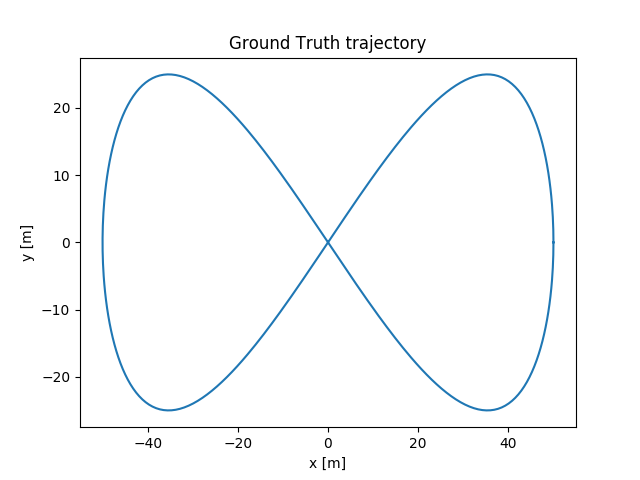
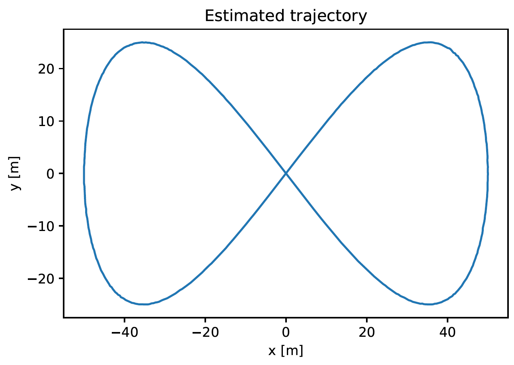
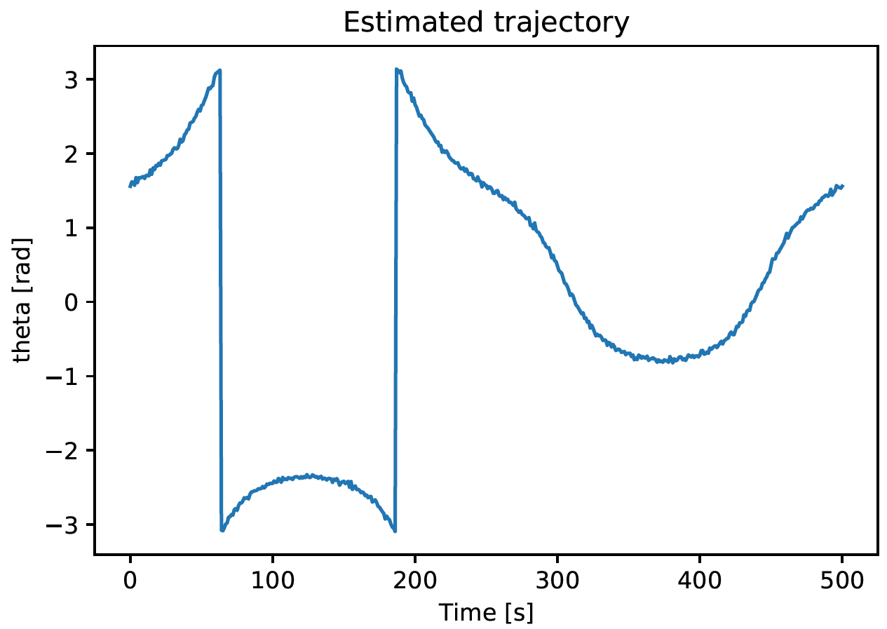

# Extended Kalman Filter (EKF)

## Description

The task at hand was to recursively estimate the state and the 2D Trajectory of a mobile platform given the position of the landmarks in the robot's frame of reference at every instant. The vehicle was equipped with a 2D LiDAR sensor and velocity inputs (translational and rotational) were given to the platform. Data association was assumed. The initial pose of the robot as well as the noise with respect to the input and sensor model was known.

## Ground Truth

  
   

## Results 

  
   

